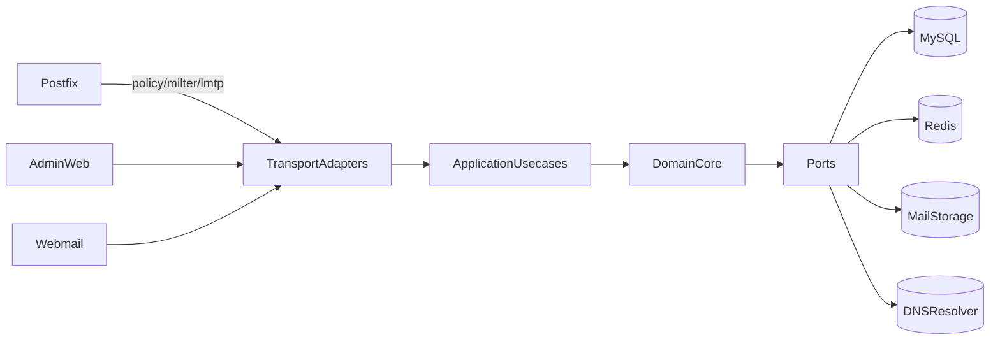

# EasyMail 工业级重构需求文档

## 1. 文档信息

- 项目：`easymail`
- 当前阶段：需求与重构蓝图（不改代码）
- 目标：将现有系统提升到工业级标准，重点提升架构可扩展性、系统稳定性、代码质量与可运维性

## 2. 背景与范围

EasyMail 是基于 Go + Postfix 扩展构建的邮件系统，覆盖用户管理、邮件存储、Web 管理后台、Webmail、反垃圾过滤，以及与 Dovecot/LMTP/Policy/Milter 的协议协同。

本次重构需求文档范围包含：

- 邮件核心链路：Postfix 扩展、Filter、LMTP、Storage
- 管理与用户访问链路：Admin、Webmail
- 配置、日志、监控、错误治理、发布与测试体系
- 架构与模块边界重塑（第一优先级）

不在本阶段范围：

- 一次性推翻重写
- 直接切换全部基础设施（如立刻引入全新消息队列）
- 改变现有业务语义（先保障兼容）

## 3. 现状能力与代码基线

### 3.1 关键模块与入口

- 启动编排：`cmd/easymail/main.go`
- 配置与基础设施初始化：`internal/database/application.go`、`internal/database/init.go`
- Postfix 配置与联动：`internal/postfix/command/configure.go`、`internal/postfix/policy/server.go`、`internal/postfix/queue/queue.go`、`internal/postfix/sync/synchronize.go`
- 邮件协议服务：
  - Dovecot auth 侧：`internal/service/dovecot/server.go`
  - Filter/milter：`internal/service/filter/server.go`、`internal/service/filter/session.go`
  - LMTP：`internal/service/lmtp/server.go`
- 管理与 Webmail：`internal/service/admin/router/router.go`、`internal/service/webmail/router/router.go`
- 数据与存储：`internal/model`、`internal/service/storage/interface.go`、`internal/service/storage/local.go`

### 3.2 现有能力（业务层）

- 用户与域管理：创建、启停、删除、密码/配额管理
- 邮件入站：Postfix -> Filter/Milter -> LMTP -> 本地存储 + 元数据入库
- 邮件出站：Webmail 通过 SMTP 转发
- 反垃圾：规则引擎 + SPF/DNS/特征抽取
- 管理后台：账户、队列、日志、配置、过滤特征

## 4. 现状问题（按严重度）

### P0（高风险）

1. **架构耦合高，边界不清晰**
   - `router/controller/model` 直连明显，业务编排与数据访问耦合。
   - 配置初始化、数据库连接与服务启动存在包级副作用，影响可测试性与可替换性。

2. **稳定性风险点明显**
   - 局部存在 `panic` 或 `fatal` 风格处理，异常隔离不充分。
   - 大邮件处理以内存累积方式为主，极端场景存在内存压力风险。

3. **协议链路的契约依赖脆弱**
   - Postfix / Milter / LMTP 依赖隐式 header 与命令行行为，缺少统一契约定义与回归保障。

### P1（重要）

1. **可扩展性不足**
   - 虽有局部接口（如 storage/filter），但插件边界与版本化契约不足。
   - 规则、策略、存储后端缺少统一扩展规范与能力矩阵。

2. **可观测能力不完整**
   - 主要依赖日志，缺少系统级 metrics/tracing 标准。
   - 健康检查深度不足，无法覆盖依赖可用性与链路状态。

3. **工程化不足**
   - CI/CD、质量门禁、分层测试体系不完整。
   - 编码规范、错误码、日志语义、配置规范未形成统一标准。

### P2（中长期）

1. **领域模型与权限治理演进受限**
   - 管理后台与 Webmail 在应用层边界与权限模型方面仍可进一步领域化。
2. **运维自动化不足**
   - 灰度、回滚、容量规划、SLO 告警等实践需要体系化。

## 5. 工业级目标需求

以下每个需求点均包含：现状、问题、目标、约束、验收标准。

### 5.1 架构可扩展性（优先级 P0）

- 现状：模块职责交叉，核心流程缺少统一应用层编排。
- 问题：新增协议/后端时改动面大，回归风险高。
- 目标：
  - 建立四层架构：`transport` / `application` / `domain` / `infrastructure`
  - 所有外部依赖通过 `port` 接口访问
  - 核心流程通过用例编排（usecase）而非 controller 直接拼装
- 约束：
  - 保持对现有 Postfix/Dovecot 协议行为兼容
  - 渐进式迁移，不中断现网
- 验收标准：
  - 新增一个存储后端或过滤策略时，修改不超过 3 个模块层级
  - 核心链路单元测试覆盖率 >= 70%，集成测试覆盖关键协议路径

### 5.2 稳定性与韧性（优先级 P0）

- 现状：部分错误处理方式激进，重试/超时/熔断策略不统一。
- 问题：异常放大，局部故障可能影响全链路可用性。
- 目标：
  - 全链路统一超时、重试、幂等、限流、熔断策略
  - 将 `panic/fatal` 改造为可恢复错误处理与降级路径
  - 大对象（邮件正文/附件）引入流式处理策略
- 约束：不改变业务结果语义（例如拒收/放行规则语义）
- 验收标准：
  - 故障注入场景下系统保持可降级且无级联崩溃
  - 内存峰值在大邮件并发场景下降低 >= 40%（基准对比）

### 5.3 代码质量与工程体系（优先级 P1）

- 现状：测试与质量门禁不完整，规范分散。
- 问题：回归成本高，变更风险难控制。
- 目标：
  - 建立统一 lint、格式化、静态检查、依赖扫描、单测与集成测试流水线
  - 建立错误码、日志字段、配置项命名规范
- 约束：兼容当前开发流程，避免一次性增加过高维护成本
- 验收标准：
  - PR 必须通过质量门禁才可合并
  - 关键包（filter/lmtp/storage/policy）覆盖率达标并持续可视化

### 5.4 安全与合规（优先级 P1）

- 现状：认证授权与操作审计可继续强化。
- 问题：在复杂运维场景中审计链不足，权限边界表达能力有限。
- 目标：
  - 完善 RBAC/域隔离模型
  - 增强敏感操作审计（谁、何时、改了什么）
  - 安全基线：密码策略、会话策略、输入校验、依赖漏洞扫描
- 约束：不破坏现有登录与管理流程
- 验收标准：
  - 高风险操作可完整追踪
  - 权限越权测试全部通过

### 5.5 可观测与可运维（优先级 P1）

- 现状：有访问日志与业务日志，但指标与链路追踪不足。
- 问题：故障定位慢，容量评估不精确。
- 目标：
  - 构建日志/指标/追踪三位一体观测体系
  - 提供健康检查、就绪检查、依赖检查端点
  - 定义 SLI/SLO 与告警阈值
- 约束：避免高开销采样影响主链路性能
- 验收标准：
  - 关键路径 P95 延迟、错误率、队列积压、投递成功率均可观测
  - 故障平均定位时间（MTTD）与恢复时间（MTTR）显著下降

## 6. 目标架构与模块边界

### 6.1 分层架构

### 6.2 模块职责重划

- `transport`：协议适配与请求解析（HTTP、Milter、LMTP、Policy、Dovecot）
- `application`：用例编排、事务边界、幂等控制、审计事件输出
- `domain`：邮件、账户、域、过滤策略等核心模型与领域服务
- `infrastructure`：DB、缓存、文件存储、DNS、系统命令执行器

### 6.3 扩展点规范（插件化）

- Filter 插件：统一输入上下文、规则执行结果、动作枚举
- Storage 插件：`Save/Read/Delete/GetAttachment` 契约 + 错误码定义
- Policy 插件：策略判定接口 + 风险评分输出
- Queue/Sync 插件：Postfix 依赖可替换执行器，支持 dry-run

### 6.4 依赖治理原则

- 上层仅依赖抽象，不依赖具体实现
- 禁止跨层直接调用基础设施细节
- 包初始化禁止副作用连接外部系统
- 所有外部调用都必须可注入、可 mock、可测

## 7. 分阶段重构路线

## Phase 0：工程基线与观测基线（2~3 周）

- 范围：
  - 建立 lint/test/coverage/安全扫描流水线
  - 标准化日志字段与错误码体系
  - 建立基础 metrics 与健康探针
- 影响面：全仓
- 风险：历史包行为差异导致门禁一次性失败
- 回滚：门禁分级启用（警告 -> 阻断）
- DoD：
  - CI 稳定运行
  - 核心服务可输出统一指标与结构化日志

## Phase 1：架构切层与模块边界重塑（4~8 周，第一优先）

- 范围：
  - 抽离 application/usecase 层
  - 将 controller 直连 model 改为 usecase + repository port
  - 引入依赖注入容器（轻量即可）
- 影响面：`internal/service/admin`、`internal/service/webmail`、`internal/model`、`internal/database`
- 风险：迁移期双路径并存带来维护成本
- 回滚：按模块灰度切换（feature flag/路由级切换）
- DoD：
  - 管理与 Webmail 关键用例迁移完成
  - 新增用例不再绕过 application 层

## Phase 2：邮件核心链路稳定化（4~6 周）

- 范围：
  - Filter/LMTP/Storage 统一契约
  - 大邮件流式处理与内存治理
  - 协议错误处理标准化（可恢复、可观测）
- 影响面：`internal/service/filter`、`internal/service/lmtp`、`internal/service/storage`、`internal/postfix/*`
- 风险：协议兼容性回归
- 回滚：保留旧链路开关，按域名/租户灰度
- DoD：
  - 核心链路压测与故障演练通过
  - 协议集成测试覆盖主要异常分支

## Phase 3：安全治理与领域深化（3~5 周）

- 范围：
  - 权限模型增强（RBAC + 域边界）
  - 审计体系与运维工具完善
  - 配置中心化与变更审计
- 影响面：admin/webmail + 配置与审计相关模块
- 风险：权限变更引发行为差异
- 回滚：按角色分组渐进切换
- DoD：
  - 越权测试、审计追踪、关键操作可回放全部通过

## 8. 里程碑与 KPI

### 8.1 交付里程碑

- M1（Phase 0 完成）：工程门禁与可观测基线上线
- M2（Phase 1 完成）：架构分层落地到管理与 Webmail 核心路径
- M3（Phase 2 完成）：邮件核心链路完成稳定化改造并压测达标
- M4（Phase 3 完成）：权限与审计体系达到生产级

### 8.2 KPI（建议门槛）

- 可用性：核心服务月可用性 >= 99.95%
- 可靠性：关键链路错误率 < 0.1%
- 性能：核心请求 P95 延迟下降 >= 30%
- 质量：关键模块覆盖率 >= 70%，高危漏洞 0 容忍
- 变更安全：回滚演练成功率 100%，发布失败可在 10 分钟内回退

## 9. 迁移与回滚策略

- 渐进迁移：以模块为单位逐步切换，避免大爆炸式重构
- 双路径保护：新旧路径并行一段时间，持续比对结果一致性
- 灰度发布：按功能开关/租户/域逐步放量
- 可回滚设计：每阶段均提供快速切回旧路径机制
- 数据安全：关键变更前后做一致性校验与审计留痕

## 10. 风险清单与应对

- 风险：历史耦合导致拆分困难
  - 应对：先契约化，再迁移实现；先核心后外围
- 风险：协议兼容回归
  - 应对：建立协议回放测试与端到端回归集
- 风险：团队节奏受重构影响
  - 应对：业务需求与重构需求双泳道管理，周级里程碑评审
- 风险：观测系统引入额外开销
  - 应对：按采样与分级策略上线，先关键链路后全量

## 11. 完成定义（DoD）

当满足以下条件，可判定达到工业级重构阶段目标：

- 架构分层与模块边界在核心链路中可见且可执行
- 新增能力通过标准扩展点接入，不需要跨层侵入修改
- 关键链路具备完善测试、可观测、告警与回滚能力
- 发布流程具备质量门禁，风险可控且可审计

---

本文件作为后续实际重构实施与验收的统一基准。下一阶段可据此拆解为 Epic -> Story -> Task，并与代码目录逐一映射执行。

## 12. 已执行改造记录（本轮）

### Phase 1（架构切层）已落地

- 新增应用层鉴权用例：`internal/application/auth/service.go`
- 新增仓储适配层：`internal/infrastructure/repository/account_auth.go`
- Admin/Webmail 登录链路改为 `controller -> application -> repository`
- 新增会话键统一定义：`internal/application/session/keys.go`

### Phase 2（核心链路稳定性）已落地

- 修复 policy 服务“拒绝后仍放行”的逻辑缺陷：`internal/postfix/policy/server.go`
- 修复 filter 收件人键名不一致问题：`internal/service/filter/session.go`
- 规则引擎执行异常从 `panic` 改为可恢复处理（临时失败）：`internal/service/filter/session.go`
- 修复附件 MD5 计算错误（小文件误用 ssdeep）：`internal/service/filter/hash.go`
- LMTP/Dovecot unix 监听参数校验修复：`internal/service/lmtp/server.go`、`internal/service/dovecot/server.go`
- LMTP 存储写入改为按收件人独立 buffer，减少会话内冗余积累：`internal/service/lmtp/server.go`

### Phase 0/3（工程与运维基线、安全与可维护性）已落地

- 引入 CI 流水线（build + test）：`.github/workflows/ci.yml`
- 引入本地工程入口：`Makefile`
- Admin/Webmail 健康检查升级为依赖探测（MySQL/Redis）：`internal/observability/health/health.go`
- 统一修复会话键使用不一致导致的鉴权问题：
  - `internal/service/admin/middleware/authorization.go`
  - `internal/service/webmail/middleware/authorization.go`
  - `internal/service/webmail/controller/string.go`
- 修复 SMTP 出站写入格式串风险：`internal/service/webmail/controller/string.go`

### 后续建议（可继续迭代）

- 将 `internal/model` 拆分为 `domain + repository impl`，进一步消除 controller/ORM 耦合
- 引入协议回放测试（milter/policy/lmtp）与故障注入测试
- 补齐统一错误码与结构化日志字段规范
